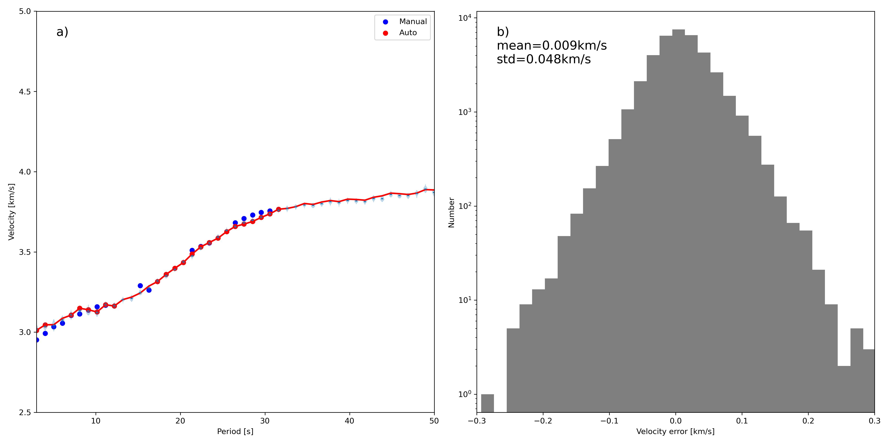

# Extract Rayleigh Wave Dispersion Curves from Noise Cross-correlation Functions
Extracting meaningful information from large seismic datasets often requires estimating the uncertainty associated with the results for quantitative analysis. This uncertainty arises from both the raw data and the manually labeled annotations. We introduce an uncertainty estimation framework designed to calculate the uncertainty from manually labeled data. This framework can efficiently output the true posterior from large datasets. We apply the framework to extract Rayleigh wave phase velocity dispersion and compute the posterior distribution of the dispersion results. We utilize 62,899 noise cross-correlation function (NCF) data from 438 stations located in Yunnan Province and manually label the Rayleigh phase velocity dispersion curves. Dispersion curve extraction presents two key challenges: (1) Researchers typically derive dispersion curves from spectrograms in the period–velocity domain, limiting the ability to directly study the relationship between NCFs and dispersion curves; (2) Assessing uncertainty in manually labeled data remains difficult. To address these challenges, the framework takes the NCFs as input and directly output both the dispersion values and the posterior of the dispersion values when processing the NCF data. This approach allows us to construct a flexible deep neural network (DNN) architecture that balances accuracy and computational efficiency. The result is shown blow:



### Train 
The training code is in the train.py and the datas are generated by EGFAnalysis.m by Yao. 

### Infer 
You can run makepicker.py to make the infer model for process single data. 
The extract_demo.py is used to extract dispersion curves from the infer model. 
The output format can be :
```text
period[s],velocity[km/s],filtered[if filtered by DNN],standerd deviation
3.0000,2.9621,False,0.0471
4.0000,2.9753,False,0.0484
```

### Contact 
You can contact me at cangye@hotmail.com

### Citation
Ziye Yu, Liu Xin. 2025. A Framework for Uncertainty Estimation in Seismology Data Processing with Application to Extract Rayleigh Wave Dispersion Curves from Noise Cross-correlation Functions. 
https://doi.org/10.48550/arXiv.2503.20460

### License
GPLv3